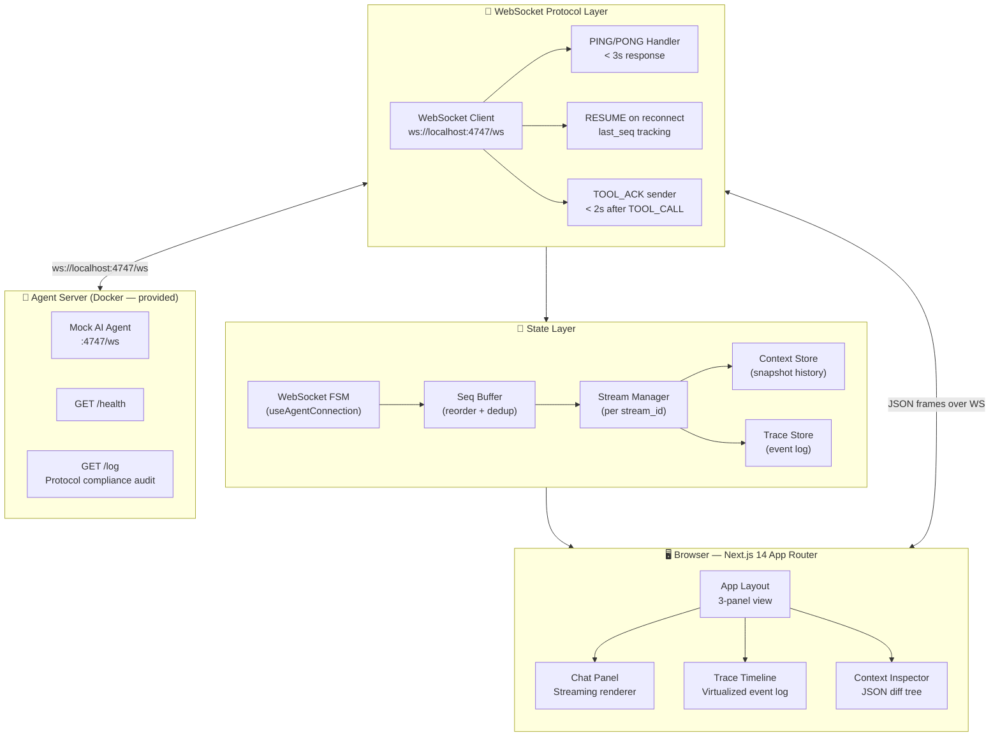
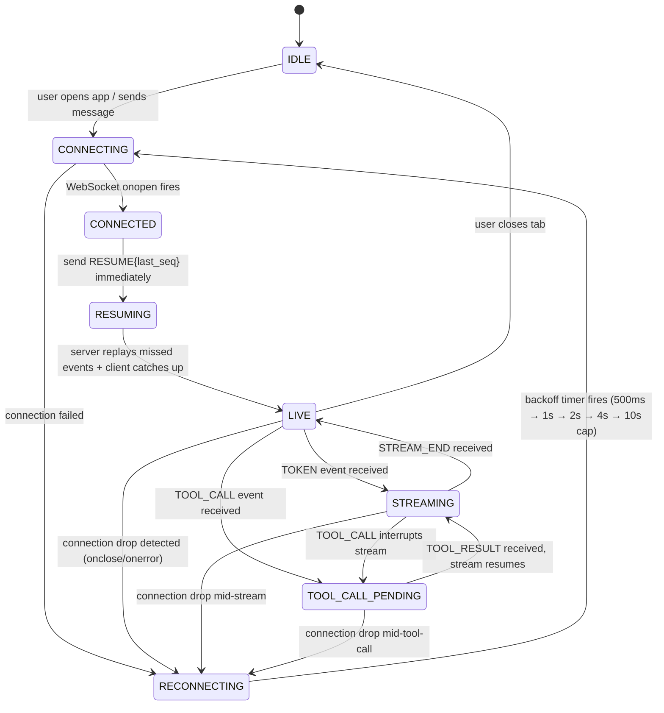
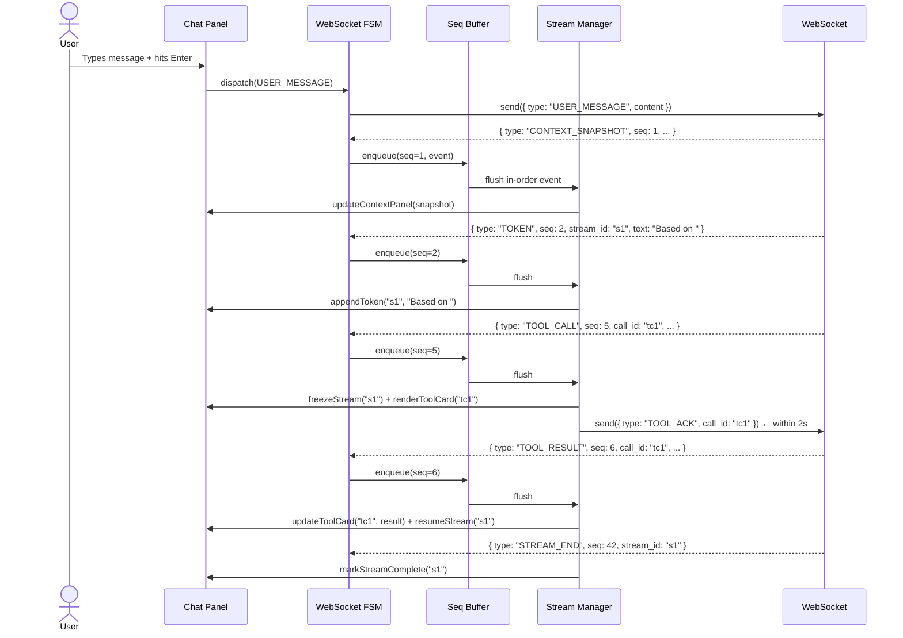

# Agent Console — Design & Architecture

> Full Stack AI Engineer Assignment — Alchemyst AI
> A resilient real-time AI agent interface built on Next.js, WebSockets, and a finite state machine core.

---

## 1. Project Summary

The Agent Console is a **Next.js 14 frontend** that connects to a mock AI agent backend over WebSockets. It streams responses token-by-token, handles mid-stream tool call interruptions, displays a live trace timeline, inspects agent context with diffs, and survives chaos mode (dropped connections, out-of-order messages, duplicate frames, corrupt heartbeats) without losing state.

This is **not** a typical chat UI. The core challenge is distributed systems engineering expressed through a render loop.

---

## 2. High-Level Architecture



---

## 3. WebSocket State Machine

This is the core of the entire application. Every connection lifecycle event is a state transition — not a scattered `useEffect`.



### State Descriptions

| State | What's happening |
|---|---|
| `IDLE` | No connection. App is waiting. |
| `CONNECTING` | WebSocket constructor called. Waiting for `onopen`. |
| `CONNECTED` | Socket open. About to send `RESUME` if we have a `last_seq`. |
| `RESUMING` | `RESUME` sent. Draining replayed events from server in seq order. |
| `LIVE` | Stable. Ready to receive messages or send `USER_MESSAGE`. |
| `STREAMING` | Actively receiving `TOKEN` events for a `stream_id`. |
| `TOOL_CALL_PENDING` | Stream frozen. Waiting for `TOOL_RESULT` after rendering tool card and sending `TOOL_ACK`. |
| `RECONNECTING` | Drop detected. Exponential backoff timer running. |

---

## 4. Data Flow — Normal Message Lifecycle



---

## 5. Sequence Buffer — The Core Data Structure

The seq buffer is what makes chaos mode survivable. Every incoming message goes through it before touching the UI.

### Design

```typescript
// lib/seq-buffer.ts

interface BufferedEvent {
  seq: number
  event: ServerMessage
  processedAt?: number
}

class SeqBuffer {
  private buffer: Map<number, BufferedEvent> = new Map()
  private nextExpected: number = 1
  private processedSeqs: Set<number> = new Set()  // dedup set

  enqueue(event: ServerMessage): void {
    const { seq } = event

    // 1. Deduplicate — chaos mode sends duplicate seq values
    if (this.processedSeqs.has(seq)) return

    // 2. Buffer it
    this.buffer.set(seq, { seq, event })

    // 3. Flush contiguous range starting from nextExpected
    this.flush()
  }

  private flush(): void {
    while (this.buffer.has(this.nextExpected)) {
      const entry = this.buffer.get(this.nextExpected)!
      this.buffer.delete(this.nextExpected)
      this.processedSeqs.add(this.nextExpected)
      this.nextExpected++
      this.onFlush(entry.event)   // fires the event downstream
    }
  }

  getLastProcessedSeq(): number {
    return this.nextExpected - 1
  }
}
```

### Why a Map + Set?

| Structure | Purpose |
|---|---|
| `Map<seq, event>` | O(1) lookup for gap filling. When seq=7 arrives before seq=5, it waits in the Map. |
| `Set<seq>` | O(1) dedup check. Chaos mode can send the same seq twice — we ignore the second. |
| `nextExpected` pointer | Tracks the frontier. Only flushes when the exact next seq arrives. |

---

## 6. Stream Manager — Tool Call State Machine

Each `stream_id` has its own mini state machine managed by the Stream Manager.

```typescript
// lib/stream-manager.ts

type StreamState = 
  | { status: 'streaming'; tokens: string[] }
  | { status: 'tool_call_pending'; tokens: string[]; pendingCalls: Map<string, ToolCallState> }
  | { status: 'complete'; tokens: string[] }

interface ToolCallState {
  call_id: string
  tool_name: string
  args: object
  result?: object
  ackSent: boolean
  ackTimer: ReturnType<typeof setTimeout>
}

class StreamManager {
  private streams: Map<string, StreamState> = new Map()

  onToken(stream_id: string, text: string): void {
    // Only append if status === 'streaming'
    // If 'tool_call_pending' — buffer the token (shouldn't happen per protocol, but chaos mode)
  }

  onToolCall(stream_id: string, call: ToolCallEvent): void {
    // Transition stream to 'tool_call_pending'
    // Schedule TOOL_ACK within 2 seconds
    // Render tool card in frozen state
  }

  onToolResult(stream_id: string, result: ToolResultEvent): void {
    // Update tool card with result
    // If all pending calls resolved → transition back to 'streaming'
    // Resume token flow
  }

  onStreamEnd(stream_id: string): void {
    // Transition to 'complete'
    // Mark last_seq as fully rendered
  }
}
```

---

## 7. Directory Structure

```
agent-console/
├── app/                          # Next.js 14 App Router
│   ├── layout.tsx                # 3-panel shell layout
│   ├── page.tsx                  # Main console page
│   └── globals.css
│
├── components/
│   ├── chat/
│   │   ├── ChatPanel.tsx         # Main chat container
│   │   ├── MessageBubble.tsx     # User + agent message
│   │   ├── StreamingText.tsx     # Incremental token renderer
│   │   ├── ToolCallCard.tsx      # Tool call + result card
│   │   └── MessageInput.tsx      # Input bar
│   │
│   ├── trace/
│   │   ├── TraceTimeline.tsx     # Virtualized event list
│   │   ├── TraceRow.tsx          # Single event row
│   │   ├── TraceFilter.tsx       # Filter bar (type + search)
│   │   └── TokenBatch.tsx        # Grouped token row (expandable)
│   │
│   └── context/
│       ├── ContextInspector.tsx  # Context panel wrapper
│       ├── JsonTree.tsx          # Syntax-highlighted tree
│       ├── DiffView.tsx          # Diff between snapshots
│       └── SnapshotScrubber.tsx  # History navigation
│
├── lib/
│   ├── ws/
│   │   ├── connection.ts         # WebSocket FSM (useAgentConnection hook)
│   │   ├── seq-buffer.ts         # Reorder + dedup buffer
│   │   ├── stream-manager.ts     # Per-stream_id state machine
│   │   ├── ping-handler.ts       # PING/PONG + corrupt challenge guard
│   │   └── reconnect.ts          # Exponential backoff logic
│   │
│   ├── diff/
│   │   ├── json-diff.ts          # Deep JSON diff engine
│   │   └── patch-types.ts        # Added / Removed / Changed types
│   │
│   └── types/
│       ├── protocol.ts           # All server + client message types
│       ├── stream.ts             # Stream + tool call state types
│       └── trace.ts              # Trace event types
│
├── store/
│   ├── useConnectionStore.ts     # FSM state + last_seq
│   ├── useStreamStore.ts         # Active streams + messages
│   ├── useTraceStore.ts          # Event log (append-only)
│   └── useContextStore.ts        # Snapshot history per context_id
│
├── hooks/
│   ├── useAgentConnection.ts     # Main WS hook — exposes sendMessage
│   ├── useTraceHighlight.ts      # Bidirectional highlight state
│   └── useVirtualScroll.ts       # For trace timeline perf
│
└── __tests__/
    ├── seq-buffer.test.ts        # Edge cases: empty, duplicates, reversed
    ├── stream-manager.test.ts    # Tool call interrupt + resume
    └── json-diff.test.ts         # Diff correctness
```

---

## 8. Tech Stack

### Frontend Only (this project has no custom backend)

| Layer | Tech | Why |
|---|---|---|
| **Framework** | Next.js 14 (App Router) | Assignment requirement |
| **Language** | TypeScript strict mode | Assignment requirement — no `any` |
| **Styling** | Tailwind CSS | Fast layout, utility-first, assignment says looks don't matter |
| **State Management** | Zustand | Lightweight, works great with real-time append-only stores. No Redux boilerplate for a WS app. |
| **Virtual List** | `@tanstack/react-virtual` | Trace timeline must handle 30+ events/sec without jank. Virtualizing the list is the only correct answer. |
| **JSON Tree** | Custom recursive component | No library handles 500KB lazy expansion well — build it with lazy node expansion |
| **Testing** | Vitest + Testing Library | Fast, ESM-native, works with Next.js |

### Backend (Provided — Docker)

| Component | Detail |
|---|---|
| Agent Server | Docker container, `ws://localhost:4747/ws` |
| Health check | `GET http://localhost:4747/health` |
| Protocol audit log | `GET http://localhost:4747/log` — verifies PONG timing, TOOL_ACK, RESUME correctness |
| Normal mode | `docker run -p 4747:4747 agent-server` |
| Chaos mode | `docker run -p 4747:4747 agent-server --mode chaos` |

> There is **no custom backend to build**. The entire engineering challenge is the frontend state machine, protocol handling, and rendering correctness.

---

## 9. Protocol Type Definitions

```typescript
// lib/types/protocol.ts

// ─── Server → Client ─────────────────────────────────────────

export interface BaseServerMessage {
  seq: number
}

export interface TokenMessage extends BaseServerMessage {
  type: 'TOKEN'
  text: string
  stream_id: string
}

export interface ToolCallMessage extends BaseServerMessage {
  type: 'TOOL_CALL'
  call_id: string
  tool_name: string
  args: Record<string, unknown>
  stream_id: string
}

export interface ToolResultMessage extends BaseServerMessage {
  type: 'TOOL_RESULT'
  call_id: string
  result: Record<string, unknown>
  stream_id: string
}

export interface ContextSnapshotMessage extends BaseServerMessage {
  type: 'CONTEXT_SNAPSHOT'
  context_id: string
  data: Record<string, unknown>
}

export interface PingMessage extends BaseServerMessage {
  type: 'PING'
  challenge: string   // may be empty string in chaos mode — handle gracefully
}

export interface StreamEndMessage extends BaseServerMessage {
  type: 'STREAM_END'
  stream_id: string
}

export interface ErrorMessage extends BaseServerMessage {
  type: 'ERROR'
  code: string
  message: string
}

export type ServerMessage =
  | TokenMessage
  | ToolCallMessage
  | ToolResultMessage
  | ContextSnapshotMessage
  | PingMessage
  | StreamEndMessage
  | ErrorMessage

// ─── Client → Server ─────────────────────────────────────────

export interface UserMessagePayload {
  type: 'USER_MESSAGE'
  content: string
}

export interface PongPayload {
  type: 'PONG'
  echo: string
}

export interface ResumePayload {
  type: 'RESUME'
  last_seq: number
}

export interface ToolAckPayload {
  type: 'TOOL_ACK'
  call_id: string
}

export type ClientMessage =
  | UserMessagePayload
  | PongPayload
  | ResumePayload
  | ToolAckPayload
```

---

## 10. State Stores (Zustand)

### Connection Store
```typescript
// store/useConnectionStore.ts
interface ConnectionState {
  status: FSMState                  // IDLE | CONNECTING | LIVE | STREAMING | etc.
  lastProcessedSeq: number          // highest seq fully rendered to DOM
  reconnectAttempts: number
  backoffMs: number                 // current backoff delay
}
```

### Stream Store
```typescript
// store/useStreamStore.ts
interface StreamStoreState {
  messages: ChatMessage[]           // final rendered message list
  activeStreams: Map<string, StreamState>  // live stream_id → state
  highlightedId: string | null      // bidirectional highlight
}
```

### Trace Store
```typescript
// store/useTraceStore.ts
interface TraceStoreState {
  events: TraceEvent[]              // append-only log
  filter: { type?: string; search?: string }
  tokenBatches: Map<string, TokenBatch>  // group consecutive TOKENs
}
// NOTE: Never re-render the full list. Only append. Virtualization handles the rest.
```

### Context Store
```typescript
// store/useContextStore.ts
interface ContextStoreState {
  snapshots: Map<string, ContextSnapshot[]>  // context_id → history[]
  currentIndex: Map<string, number>          // context_id → scrubber position
  diffs: Map<string, JsonDiff>               // context_id → diff vs previous
}
```

---

## 11. Reconnection Strategy

```
Attempt 1: wait 500ms  → reconnect
Attempt 2: wait 1000ms → reconnect
Attempt 3: wait 2000ms → reconnect
Attempt 4: wait 4000ms → reconnect
Attempt 5+: wait 10000ms (capped) → reconnect
```

On successful reconnect:
1. Send `RESUME { last_seq: lastProcessedSeq }` as the **very first message** — before anything else
2. Server replays all events with `seq > last_seq`
3. Seq buffer deduplicates anything already processed
4. Stream Manager stitches replayed events into existing DOM state
5. If a `TOOL_CALL` was mid-flight — card stays in "waiting" state, result arrives via replay

---

## 12. Chaos Mode Survival Plan

| Chaos Behaviour | Our Defense |
|---|---|
| Connection drop | FSM detects `onclose`/`onerror` → transitions to `RECONNECTING` → exponential backoff → `RESUME` on reconnect |
| Out-of-order `seq` | Seq Buffer holds messages until contiguous range is complete, then flushes in order |
| Duplicate `seq` | `processedSeqs: Set<number>` — O(1) dedup check before enqueue |
| Rapid tool calls | Stream Manager tracks `pendingCalls: Map<call_id, ToolCallState>` — multiple calls stack, not overwrite |
| Corrupt PING (empty challenge) | `ping-handler.ts` checks `challenge` before using it — sends `PONG { echo: "" }` safely, no crash |
| Oversized context (500KB+) | JSON tree uses lazy expansion — top-level keys only on first render, children load on click. No full parse into DOM. |
| Latency spike | Buffer holds tokens, UI shows "agent thinking..." indicator. No timeout that would break state. |

---

## 13. Rendering Strategy — No Layout Shift on Tool Calls

This is the hardest UI problem in the assignment.

**The problem:** Text is streaming character by character. A `TOOL_CALL` arrives. If we re-render the message component, the text reflows and the user sees a jump.

**The solution:**

```
StreamingText component uses a ref to append tokens directly to the DOM
(via textContent or innerHTML on a span) — bypassing React's virtual DOM
reconciliation for the hot path.

When TOOL_CALL arrives:
1. The span is frozen in place (no more appends)
2. A ToolCallCard is appended BELOW the frozen span (new DOM node, not a re-render)
3. The span's parent div has min-height set to current height — prevents collapse

When TOOL_RESULT arrives:
1. ToolCallCard content updates (isolated re-render, doesn't touch the text span)
2. A new streaming span is created BELOW the tool card for resumed tokens
3. User sees: [frozen text] → [tool card with result] → [new text] — seamless
```

This means the chat message is not a single React component re-rendering. It's a **sequence of frozen text nodes and tool cards** built incrementally.

---

## 14. Trace Timeline Performance

30+ events per second will destroy a naive React list.

**Strategy:**
- Use `@tanstack/react-virtual` — only renders rows visible in the viewport
- Trace store is **append-only** — no mutations, no re-renders of existing rows
- Consecutive `TOKEN` events are batched into a single `TokenBatch` row with a counter
- The batch row updates its counter in-place via a ref (no re-render)
- New event types (TOOL_CALL, PING, ERROR) always get their own row

---

## 15. Context Inspector — Diff Engine

```typescript
// lib/diff/json-diff.ts

type DiffEntry =
  | { op: 'added';   path: string; value: unknown }
  | { op: 'removed'; path: string; oldValue: unknown }
  | { op: 'changed'; path: string; oldValue: unknown; newValue: unknown }

function diffJson(
  prev: Record<string, unknown>,
  next: Record<string, unknown>,
  path = ''
): DiffEntry[] {
  // Recursive deep diff
  // Returns flat list of changes with dot-notation paths
  // e.g. { op: 'changed', path: 'report.pages', oldValue: 47, newValue: 52 }
}
```

The JSON tree component color-codes nodes:
- 🟢 Green background = added key
- 🔴 Red background = removed key  
- 🟡 Yellow background = changed value
- No highlight = unchanged

---

## 16. Known Protocol Issues (DECISIONS.md Preview)

**Race condition in TOOL_ACK timeout:**

The server waits 5 seconds for `TOOL_ACK`. The client is supposed to send it within 2 seconds. But if the client is processing a burst of out-of-order messages from the seq buffer (chaos mode), the TOOL_ACK could be delayed past 2 seconds even though the client received the TOOL_CALL on time.

**Fix:** `TOOL_ACK` is sent immediately when the `TOOL_CALL` exits the seq buffer — before the tool card is even rendered. The 2-second target is for rendering; the ACK is fire-and-forget on receipt.

---

## 17. Build & Run

```bash
# 1. Start the agent server (normal mode)
cd agent-server
docker build -t agent-server .
docker run -p 4747:4747 agent-server

# 2. Install and run the Next.js app
cd agent-console
npm install
npm run dev         # development
npm run build && npm run start   # production

# 3. Open http://localhost:3000
# WebSocket connects automatically to ws://localhost:4747/ws

# 4. Chaos mode test
docker run -p 4747:4747 agent-server --mode chaos
```

---

## 18. Phased Build Order

### Phase 1 — Protocol Foundation (Day 1)
- [ ] Next.js 14 project init with TypeScript strict mode + Tailwind
- [ ] All protocol type definitions (`lib/types/protocol.ts`)
- [ ] Seq Buffer implementation + unit tests
- [ ] WebSocket FSM skeleton (`useAgentConnection` hook)
- [ ] PING/PONG handler with corrupt challenge guard
- [ ] Basic reconnection with exponential backoff
- [ ] Send `USER_MESSAGE`, receive raw events, log to console

**Checkpoint:** `/log` endpoint shows correct PONG timing and RESUME on reconnect.

---

### Phase 2 — Streaming Chat (Day 2)
- [ ] Stream Manager with tool call state machine
- [ ] `StreamingText` component (ref-based DOM append, no React reconcile on hot path)
- [ ] `ToolCallCard` component (frozen text → card → resume)
- [ ] `TOOL_ACK` sent on TOOL_CALL receipt (before render)
- [ ] Multiple sequential tool calls stacking correctly
- [ ] `MessageInput` + basic chat layout

**Checkpoint:** Full message lifecycle works. Tool call interrupts and resumes with no flicker.

---

### Phase 3 — Trace Timeline (Day 3)
- [ ] Trace Store (append-only)
- [ ] Virtualized `TraceTimeline` with `@tanstack/react-virtual`
- [ ] `TokenBatch` grouping for consecutive TOKEN events
- [ ] TOOL_CALL + TOOL_RESULT visual linking by `call_id`
- [ ] Filter bar (event type + text search)
- [ ] Bidirectional highlight (trace ↔ chat)

**Checkpoint:** Timeline handles 30+ events/sec without jank. Filtering works.

---

### Phase 4 — Context Inspector (Day 3–4)
- [ ] Context Store with snapshot history
- [ ] `JsonTree` with lazy expansion (handles 500KB)
- [ ] `DiffView` with color-coded changes
- [ ] `SnapshotScrubber` (forward/back through history)

**Checkpoint:** 500KB context snapshot renders without freezing. Diff highlights correctly.

---

### Phase 5 — Chaos Survival + Polish (Day 4–5)
- [ ] Full chaos mode testing
- [ ] Screen recording (5 scenarios as required)
- [ ] `DECISIONS.md` writeup
- [ ] `README.md` with state machine diagram + screenshots
- [ ] `npm run build` passes cleanly
- [ ] Unit tests: seq-buffer, stream-manager, json-diff

**Checkpoint:** App survives 3 minutes of chaos mode with no crashes, no lost messages, no DOM inconsistency.

---

## 19. Key Design Decisions Summary

| Decision | Choice | Why |
|---|---|---|
| State management | Zustand | Lightweight, works naturally with append-only real-time stores. No Redux ceremony for a WS app. |
| Seq ordering | `Map<seq, event>` + pointer | O(1) insertion and lookup. Flushes contiguous runs automatically. |
| Deduplication | `Set<number>` | O(1) check on every incoming message. |
| Streaming render | Ref-based DOM append | Bypasses React reconciler on the token hot path. Zero layout shift. |
| Tool call freeze | Separate DOM nodes per segment | Frozen text node + new text node after result. No re-render of existing text. |
| Trace performance | TanStack Virtual | Only renders visible rows. 30+ events/sec is fine with a 60fps viewport. |
| Context diff | Custom recursive diff | Libraries don't handle lazy-expanded 500KB trees well. Full control needed. |
| TOOL_ACK timing | Fire on seq-buffer flush | Before render — guarantees < 2s even under heavy reordering. |
| Backoff | 500ms → 1s → 2s → 4s → 10s cap | Standard exponential backoff. Cap prevents thundering herd in prolonged outages. |
